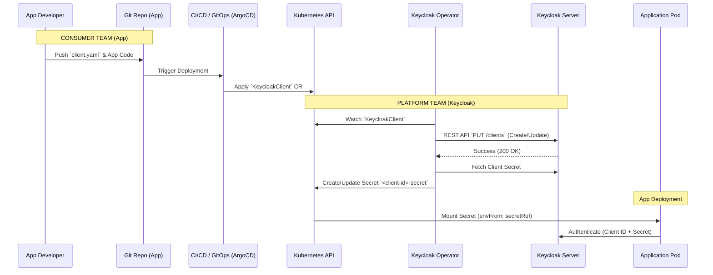

# Keycloak Client Operator: Architecture & Usage

## Overview

The Keycloak Client Operator enables a **declarative, Kubernetes-native approach** to managing Keycloak Clients (OIDC/SAML). Instead of manual configuration via the Keycloak Admin Console, teams define their client requirements as checks-in code (`KeycloakClient` CRD), enabling a full **GitOps workflow**.

## Architecture

The operator follows the Kubernetes Controller pattern:
1.  **Watch**: Monitors `KeycloakClient` Custom Resources.
2.  **Reconcile**: Ensures the state in Keycloak matches the CR (creates or updates the client).
3.  **Sync Secrets**: Automatically retrieves the client secret generates a Kubernetes Secret.

### GitOps Workflow



## Usage Guide

### 1. Define a Client
Create a `client.yaml` in your application repository:

```yaml
apiVersion: keycloak.ocm.software/v1alpha1
kind: KeycloakClient
metadata:
  name: my-dashboard
  namespace: keycloak-prod # Must match Keycloak instance namespace
spec:
  clientId: my-dashboard-client
  enabled: true
  redirectUris:
    - "https://dashboard.example.com/*"
  webOrigins:
    - "https://dashboard.example.com"
```

### 2. Apply Configuration
Apply the file via `kubectl` or your GitOps tool (ArgoCD/Flux):

```bash
kubectl apply -f client.yaml
```

### 3. Consume Credentials
The operator automatically creates a secret named `<spec.clientId>-secret` (e.g., `my-dashboard-client-secret`) containing:
-   `CLIENT_ID`
-   `CLIENT_SECRET`

Mount this secret in your application Deployment:

```yaml
env:
  - name: OIDC_CLIENT_ID
    valueFrom:
      secretKeyRef:
        name: my-dashboard-client-secret
        key: CLIENT_ID
  - name: OIDC_CLIENT_SECRET
    valueFrom:
      secretKeyRef:
        name: my-dashboard-client-secret
        key: CLIENT_SECRET
```

## Troubleshooting

### Check Status
Inspect the CR status to verify successful synchronization:

```bash
kubectl get keycloakclients -n <namespace>
# NAME                  READY   CLIENTID              AGE
# my-dashboard          true    my-dashboard-client   2m
```

### Operator Logs
If the client is not created, check the operator logs:

```bash
kubectl logs -l app=keycloak-client-operator -n <namespace>
```
