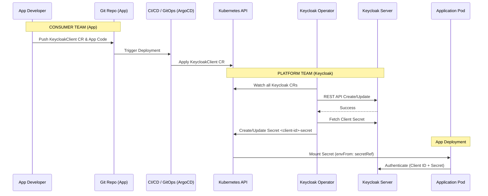

# Keycloak Operator: Usage Guide

## Overview

The Keycloak Operator enables a **declarative, Kubernetes-native approach** to managing Keycloak configuration. Instead of manual changes via the Keycloak Admin Console, teams define their requirements as Kubernetes Custom Resources (CRDs) and commit them to Git, enabling a full **GitOps workflow**.

The operator covers the full Keycloak resource hierarchy:

```text
KeycloakInstance (via KRO)
└── KeycloakRealm
    ├── KeycloakClient       (realmRef required)
    ├── KeycloakClientScope  (realmRef required)
    ├── KeycloakGroup        (realmRef required)
    └── KeycloakUser         (realmRef required, groups resolved at sync)
```

All resources are **namespace-scoped** and must be applied to the namespace of their target Keycloak instance (e.g. `keycloak-dev`). The operator reconciles them in dependency order every cycle:

1. Realms
2. ClientScopes
3. Groups
4. Clients
5. Users (group memberships resolved after groups are synced)

---

## GitOps Workflow

The typical flow for an application team consuming a Keycloak client:



---

## KeycloakRealm

Realms are the top-level container for all other resources. Create a realm before applying any clients, scopes, groups, or users that reference it.

```yaml
apiVersion: keycloak.ocm.software/v1alpha1
kind: KeycloakRealm
metadata:
  name: tenant-a
  namespace: keycloak-dev
spec:
  realmName: tenant-a          # Keycloak realm ID — immutable after creation
  displayName: "Tenant A"
  enabled: true
  registrationAllowed: false
  resetPasswordAllowed: true
  bruteForceProtected: true
  accessTokenLifespan: 300     # seconds
```

```bash
kubectl apply -f realm.yaml
kubectl get keycloakrealms -n keycloak-dev
# NAME       REALMNAME   ENABLED   READY   AGE
# tenant-a   tenant-a    true      true    30s
```

> `realmName` is the Keycloak realm ID used as the identifier in all API calls. Do not change it after creation — the operator will attempt to create a second realm rather than rename the existing one.

> Deleting a `KeycloakRealm` CR does **not** delete the realm from Keycloak — the realm is intentionally preserved to protect existing users and sessions. Remove it manually via the Keycloak Admin Console if needed.

> Deleting any other CR type (`KeycloakClient`, `KeycloakGroup`, `KeycloakUser`, `KeycloakClientScope`) **does** remove the corresponding resource from Keycloak. The operator uses Kubernetes finalizers to propagate the deletion before the CR is garbage-collected.

---

## KeycloakClientScope

```yaml
apiVersion: keycloak.ocm.software/v1alpha1
kind: KeycloakClientScope
metadata:
  name: tenant-a-profile
  namespace: keycloak-dev
spec:
  realmRef: tenant-a
  name: profile
  protocol: openid-connect
  description: "Standard profile scope exposing name and email claims"
  attributes:
    include.in.token.scope: "true"
    display.on.consent.screen: "true"
    consent.screen.text: "Access your profile information"
```

```bash
kubectl get keycloakclientscopes -n keycloak-dev
# NAME                REALM      SCOPENAME   PROTOCOL        READY
# tenant-a-profile    tenant-a   profile     openid-connect  true
```

---

## KeycloakGroup

```yaml
apiVersion: keycloak.ocm.software/v1alpha1
kind: KeycloakGroup
metadata:
  name: tenant-a-developers
  namespace: keycloak-dev
spec:
  realmRef: tenant-a
  name: developers
  attributes:
    department: engineering
  realmRoles:
    - developer
```

```bash
kubectl get keycloakgroups -n keycloak-dev
# NAME                   REALM      GROUPNAME    READY
# tenant-a-developers    tenant-a   developers   true
```

---

## KeycloakClient

Clients are the most frequently changing resource — every application deployment may add or update one. The operator creates a Kubernetes Secret with the client credentials, ready to be mounted into the application pod.

```yaml
apiVersion: keycloak.ocm.software/v1alpha1
kind: KeycloakClient
metadata:
  name: my-app
  namespace: keycloak-dev
spec:
  realmRef: tenant-a           # defaults to "master" if omitted
  clientId: my-app
  enabled: true
  redirectUris:
    - "https://my-app.example.com/*"
  webOrigins:
    - "https://my-app.example.com"
```

The operator automatically creates a secret named `<spec.clientId>-secret` (e.g. `my-app-secret`) containing `CLIENT_ID` and `CLIENT_SECRET`. Mount it in your application:

```yaml
env:
  - name: OIDC_CLIENT_ID
    valueFrom:
      secretKeyRef:
        name: my-app-secret
        key: CLIENT_ID
  - name: OIDC_CLIENT_SECRET
    valueFrom:
      secretKeyRef:
        name: my-app-secret
        key: CLIENT_SECRET
```

```bash
kubectl get keycloakclients -n keycloak-dev
# NAME     REALM      CLIENTID   PROTOCOL        READY   AGE
# my-app   tenant-a   my-app     openid-connect  true    2m
```

---

## KeycloakUser

```yaml
apiVersion: keycloak.ocm.software/v1alpha1
kind: KeycloakUser
metadata:
  name: jane-doe
  namespace: keycloak-dev
spec:
  realmRef: tenant-a
  username: jane.doe
  email: jane.doe@example.com
  firstName: Jane
  lastName: Doe
  enabled: true
  emailVerified: false
  groups:
    - developers            # resolved to group ID at sync time
  initialPassword:
    secretName: jane-doe-initial-password
    secretKey: password     # default key name
```

Create the initial password Secret before applying the user CR:

```bash
kubectl create secret generic jane-doe-initial-password \
  --namespace keycloak-dev \
  --from-literal=password=ChangeMeNow!
```

```bash
kubectl get keycloakusers -n keycloak-dev
# NAME       REALM      USERNAME    EMAIL                    READY
# jane-doe   tenant-a   jane.doe    jane.doe@example.com     true
```

> `initialPassword` is written **only on user creation**. Changing the secret or spec after creation does not reset the Keycloak password — use the Admin Console or API for subsequent changes.

> Group membership is synced every reconciliation cycle. Adding a group to `spec.groups` adds the user to it on the next cycle; removing a group from the spec does **not** remove the membership in this version.

---

## CR Status and Conditions

Every resource managed by the operator exposes a `status` subresource updated on every reconciliation pass. The standard fields are:

| Field | Type | Description |
|---|---|---|
| `status.ready` | boolean | `true` when the resource is in sync with Keycloak |
| `status.keycloakId` | string | The Keycloak-internal UUID of the managed object |
| `status.message` | string | Human-readable summary of the last operation or error |
| `status.lastSyncTime` | string (RFC3339) | Timestamp of the last reconciliation attempt |
| `status.conditions` | array | Kubernetes-standard condition entries |

The `conditions` array contains a single `Ready` condition whose `status` is `"True"` on success and `"False"` on any failure, with a descriptive `reason` and `message`:

```bash
kubectl get keycloakclients -n keycloak-dev -o wide
# NAME     REALM      CLIENTID   PROTOCOL        READY   AGE
# my-app   tenant-a   my-app     openid-connect  true    2m

kubectl describe keycloakclient my-app -n keycloak-dev
# Status:
#   Conditions:
#     Last Transition Time:  2026-03-04T10:00:00Z
#     Message:               Synced successfully
#     Reason:                Synced
#     Status:                True
#     Type:                  Ready
#   Keycloak Id:             b3f2c1d4-...
#   Last Sync Time:          2026-03-04T10:00:00Z
#   Message:                 Synced successfully
#   Ready:                   true
```

When Keycloak is unreachable, the condition flips to `Ready=False` with the HTTP error in `message`. Once connectivity is restored the next reconciliation cycle sets it back to `Ready=True` automatically.

---

## Troubleshooting

### Check resource status

```bash
kubectl get keycloakrealms,keycloakclients,keycloakgroups,keycloakusers,keycloakclientscopes -n keycloak-dev
kubectl describe keycloakrealm tenant-a -n keycloak-dev
```

### Operator logs

```bash
kubectl logs -l app=keycloak-client-operator -n keycloak-dev --follow
```

### Common issues

| Symptom | Likely cause |
|---|---|
| `status.ready: false`, message contains `404` | Realm in `realmRef` does not exist yet — apply the `KeycloakRealm` CR first |
| User ready but group not joined | Group CR not yet synced — check `KeycloakGroup` status |
| Client secret not created | Check operator logs; token auth failure or `publicClient: true` |

---

## Related Documents

| Topic | Document |
|---|---|
| Architecture overview | [ARCHITECTURE.md](ARCHITECTURE.md) |
| Operator strategy & ADR | [CLIENT.md](CLIENT.md) |
| PostgreSQL with CloudNativePG | [DATABASE.md](DATABASE.md) |
| Deployment guide | [DEPLOYMENT.md](DEPLOYMENT.md) |
| Upgrade runbook | [UPGRADE.md](UPGRADE.md) |
